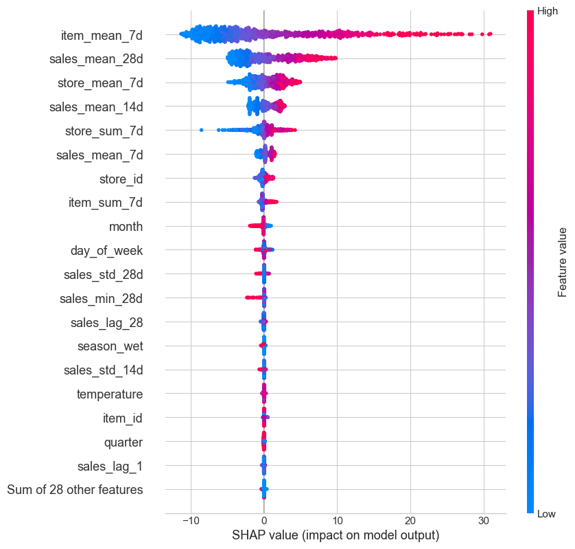
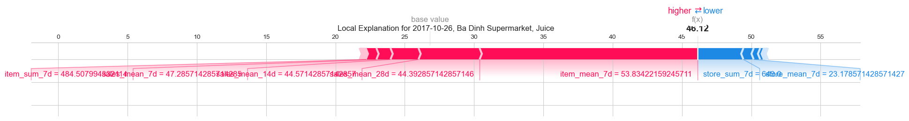
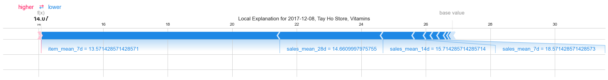
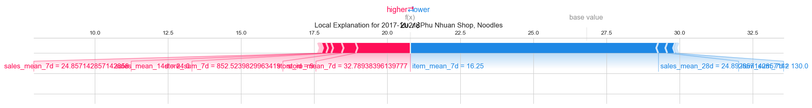
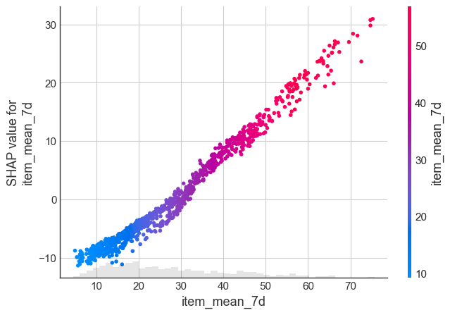

# SHAP Value Analysis Report – Sales Forecasting Model

This report summarizes SHAP-based insights from a sales forecasting model across 10 stores and 35 products. It highlights feature importance, temporal and weather effects, and local explanations for specific predictions.

## 1. Global Feature Importance

| Feature Group     | Impact (%) | Explanation                                                                   |
| ----------------- | ---------- | ----------------------------------------------------------------------------- |
| **Item**          | 46.4%      | Product-level features (`item_mean_7d`, `item_sum_7d`, etc.) drive forecasts. |
| **Sales History** | 32.8%      | Rolling features (mean, std, lag) capture recent trends effectively.          |
| **Store**         | 18.1%      | Store-level performance impacts forecasts to a moderate degree.               |
| **Date/Time**     | 2.2%       | Features like `month`, `day_of_week` have minor influence.                    |
| **Weather**       | 0.4%       | Minimal effect overall.                                                       |
| **Other**         | 0.1%       | Mostly identifiers with little or no predictive value.                        |

<!-- 
 -->

  

### Business Insights

#### **1. Product-level Features Are Critical**

- Nearly **50%** of model impact comes from product-specific features.
- Prioritize product segmentation to manage **inventory**, **pricing**, and **promotion**.
- Closely track **fast-moving** or **volatile** products.

#### **2. Sales History Is Foundational**

- Rolling averages and lag values provide essential trend signals.
- Also valuable for use in **BI dashboards** and **inventory planning**.

#### **3. Store Performance Has Moderate Influence**

- Important for **allocating stock** across locations.
- Consider clustering stores by performance.
- Support **underperforming stores** with high-potential products.

#### **4. Date and Weather Are Less Relevant**

- Minimal influence implies **low seasonality** or **weak weather dependency** in the dataset.

## 2. Most Influential Features

The top predictive features include:

- **`item_mean_7d`**: Average product sales over the past 7 days

  - High → boosts predictions (red in SHAP plot)
  - Low → lowers predictions (blue in SHAP plot)

- **`sales_mean_28d`**: 28-day average sales — signals stable performance.
- **`store_mean_7d`**: Recent store-level performance — helps adjust forecasts.
- **`sales_mean_14d`**: Captures short-to-mid-term trends.
- **`store_sum_7d`**: Total store sales — reflects local demand levels.
- **`item_id`, `store_id`**: May represent store/product-specific effects.
- **`temperature`, `season_wet`**: Weather features — minor contributors.

**Key Insight**:
The model is most sensitive to **recent sales trends**, especially at the product level.

<!--  -->

  

## 3. Weather Feature Impact

| Weather Feature | SHAP Effect | Interpretation                                    |
| --------------- | ----------- | ------------------------------------------------- |
| `temperature`   | -0.0174     | Decreases forecasts; strongest weather influence. |
| `season_winter` | -0.0108     | Winter is linked to lower demand.                 |
| Other features  | ≈ 0         | No meaningful contribution to predictions.        |

- Low temperatures may reduce demand for some product types (e.g., cold beverages).

## 4. Local Explanation Examples

### Juice – Ba Dinh Supermarket (2017-10-26)

**Actual**: 60.00 | **Predicted**: 46.12

#### Top Factors Increasing Prediction

| Feature          | SHAP Effect |
| ---------------- | ----------- |
| `item_mean_7d`   | +15.73      |
| `sales_mean_28d` | +4.41       |
| `sales_mean_14d` | +2.02       |
| `sales_mean_7d`  | +1.02       |
| `item_sum_7d`    | +0.77       |

#### Top Factors Decreasing Prediction

| Feature         | SHAP Effect |
| --------------- | ----------- |
| `store_sum_7d`  | -3.31       |
| `store_mean_7d` | -0.74       |
| `month`         | -0.47       |
| `store_id`      | -0.27       |
| `item_id`       | -0.08       |

**Insight**: The product had strong individual performance, but weak store-level signals dragged the forecast down. It may be a high-potential item in a low-performing location.

  

### Vitamins – Tay Ho Store (2017-12-08)

**Actual**: 14.00 | **Predicted**: 14.07

#### Top Factors Increasing Prediction

| Feature         | SHAP Effect |
| --------------- | ----------- |
| `store_sum_7d`  | +0.041      |
| `sales_min_28d` | +0.011      |
| `season_wet`    | +0.010      |
| `sales_std_28d` | +0.008      |
| `sales_min_7d`  | +0.007      |

#### Top Factors Decreasing Prediction

| Feature          | SHAP Effect |
| ---------------- | ----------- |
| `item_mean_7d`   | -7.40       |
| `sales_mean_28d` | -3.19       |
| `sales_mean_14d` | -0.98       |
| `sales_mean_7d`  | -0.35       |
| `store_id`       | -0.21       |

**Insight**: Consistent low recent sales for the product led to a suppressed prediction. The model accurately reflected limited demand.

  

### Noodles – Phu Nhuan Shop (2017-11-21)

**Actual**: 19.00 | **Predicted**: 20.78

#### Top Factors Increasing Prediction

| Feature          | SHAP Effect |
| ---------------- | ----------- |
| `store_mean_7d`  | +1.86       |
| `store_id`       | +0.48       |
| `store_sum_7d`   | +0.36       |
| `sales_mean_14d` | +0.17       |
| `sales_mean_7d`  | +0.17       |

#### Top Factors Decreasing Prediction

| Feature          | SHAP Effect |
| ---------------- | ----------- |
| `item_mean_7d`   | -8.49       |
| `sales_mean_28d` | -0.31       |
| `item_sum_7d`    | -0.26       |
| `month`          | -0.06       |
| `season_wet`     | -0.02       |

**Insight**: Although the product performed poorly, strong store-level signals caused the model to slightly overpredict. A rebalancing of feature weights may help.

  

## 5. SHAP Dependency Plot – `item_mean_7d`

- Clear linear relationship: as recent product sales increase, the model prediction increases.
- Threshold insight:
  - **`item_mean_7d` < 20** → forecast decreases
  - **`item_mean_7d` > 30** → forecast increases sharply
- Suggested rule: use **30** as a threshold to classify fast-moving products.

<!--  -->

  

## Conclusion

1. Product-level trends are the most decisive drivers of forecast outcomes.
2. Recent sales signals (7, 14, 28 days) form the model's core logic.
3. Store context matters but can sometimes over-influence results.
4. Weather and seasonal effects are weak and may be optional.
5. Forecasting accuracy improves around weekends and in December — plan inventory and promotions accordingly.
